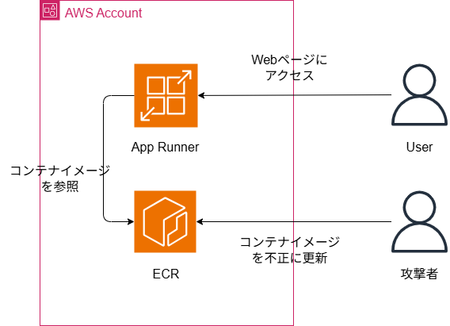

# Vulnerable ECR Demo

ECRのセキュリティリスクを検証するためのデモ環境です。

## アーキテクチャ



## 概要

このプロジェクトは、ECRリポジトリのセキュリティ設定の重要性を示すデモ環境です。

### 構成要素

- **ECR**: プライベートリポジトリ（すべてのアカウントからアクセス可能に設定）
- **App Runner**: Webアプリケーションをホスト
- **Flask App**: 改ざんしやすいシンプルなWebアプリ

### セキュリティリスク

1. **リポジトリポリシー**: すべてのアカウントからの接続を許可
2. **latestタグ**: 固定タグの使用により改ざんリスクが高い

## デプロイ方法

```bash
npm install
npx cdk deploy --profile <your-profile>
```

## 検証シナリオ

1. 別アカウントからECRイメージをPull
2. アプリケーションを改ざん
3. 同じタグでPushして破壊活動を実行

## 注意

このプロジェクトは教育目的のみで使用してください。